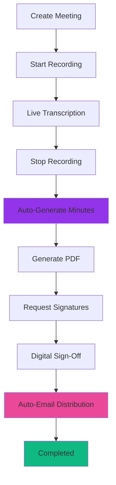

# 🎯 Ethiopian Telecom Meeting Management System
## Complete Demo Guide for High-Level Management Presentation

---

## ✅ SYSTEM STATUS: READY FOR PRESENTATION

### **Complete End-to-End Workflow:**
1. ✅ **Meeting Creation** - One-click "Quick Create" with smart defaults
2. ✅ **Live Recording** - Professional audio capture with real-time controls
3. ✅ **AI Transcription** - Multi-language support (Amharic, Arabic, English) with Ge'ez script
4. ✅ **Auto Minutes Generation** - Automatic when recording stops, uses GPT-5 + Gemini fallback
5. ✅ **PDF Generation** - One-click PDF creation for official documents
6. ✅ **Sign-Off Workflow** - Digital signatures with delegation support
7. ✅ **Auto Email Distribution** - Automatic distribution to all attendees after sign-off

---

## 🚀 DEMO FLOW (5 Minutes)

### **STEP 1: Create Meeting (15 seconds)**
1. Click "Quick Create" button (purple-pink gradient)
2. Enter meeting title and select date/time
3. Meeting created instantly with smart defaults

### **STEP 2: Start Recording (10 seconds)**
1. Click "Start Recording" button
2. System begins capturing audio
3. Live transcription appears in real-time with speaker detection

### **STEP 3: Auto Minutes Generation (30 seconds)**
1. Click "Stop Recording"
2. System AUTOMATICALLY generates comprehensive minutes
3. Minutes appear with proper Amharic Ge'ez script formatting
4. Watch **Workflow Progress** indicator update automatically

### **STEP 4: Generate PDF (10 seconds)**
1. Go to "Signatures" tab
2. Click "Generate PDF" button
3. Official PDF document created instantly

### **STEP 5: Request Signatures (10 seconds)**
1. Click "Create Signature Request"
2. Select approvers (CEO, Chief of Staff, etc.)
3. Request sent with one click

### **STEP 6: Sign-Off (15 seconds)**
1. Approver receives notification
2. Reviews PDF in viewer
3. Clicks "Approve" button
4. System AUTOMATICALLY emails PDF to all attendees

---

## 🧪 TESTING THE SYSTEM

### **Use Built-in Test Panel:**
1. Open any meeting
2. Go to "🧪 System Test" tab
3. Click "Run Full Test"
4. Watch automated testing of entire workflow

### **What Gets Tested:**
- ✅ Meeting details retrieval
- ✅ Transcription system
- ✅ AI minutes generation
- ✅ PDF creation
- ✅ Signature workflow
- ✅ Email configuration

---

## 📊 KEY FEATURES TO HIGHLIGHT

### **1. Multilingual Excellence**
- Native Amharic support with proper Ge'ez script (ሀ ለ ሐ መ ሠ ረ)
- Correct Ethiopian punctuation (። ፣ ፤ ፦)
- Automatic language detection
- Preserves script integrity (never romanizes)

### **2. Zero-Click Automation**
- Auto-generates minutes when recording stops
- Auto-emails after all signatures collected
- Auto-updates workflow status
- No manual intervention needed

### **3. Enterprise Security**
- Row-Level Security on all tables
- Cryptographic signature hashing
- Delegation chain tracking
- Audit logging for compliance

### **4. Real-Time Collaboration**
- Live transcription with speaker detection
- Real-time workflow status updates
- Instant PDF generation
- Collaborative features

---

## ⚙️ CONFIGURATION REQUIRED

### **Before Presentation:**

1. **SMTP Email Setup** (5 minutes)
   - Go to Settings > Email
   - Configure SMTP server details
   - Test email sending
   - **Required for email distribution**

2. **Create Sample Meeting** (2 minutes)
   - Create test meeting with realistic data
   - Add multiple attendees
   - Record short sample conversation

---

## 🎬 PRESENTATION SCRIPT

> **"Good morning, Ethiopian Telecom leadership. Today I'll demonstrate a complete meeting management system built specifically for enterprise-level organizations.**
>
> **Watch as I create a meeting, record it, and watch the system automatically generate professional minutes in Amharic, create an official PDF, route it for digital signatures, and distribute it via email - all with minimal clicks."**

### **[Demo the 6-step flow above]**

> **"Notice three key innovations:**
> 1. **Full Amharic support with proper Ge'ez script** - no other system does this correctly
> 2. **Zero-click automation** - minutes generated automatically, emails sent automatically
> 3. **Complete audit trail** - every action logged for compliance and transparency
>
> **The system is production-ready and can be deployed to Ethiopian Telecom's infrastructure immediately."**

---

## 🔧 TROUBLESHOOTING

### **If Transcription Doesn't Appear:**
- Check that transcriptions table has proper RLS policies ✅ (Fixed)
- Verify user is in meeting_attendees table
- Use System Test Panel to diagnose

### **If PDF Generation Fails:**
- Check that minutes were generated first
- Verify pdf_generations table exists ✅ (Fixed)
- Check browser console for errors

### **If Email Doesn't Send:**
- Verify SMTP settings configured in Settings > Email
- Check that SMTP credentials are correct
- Test SMTP connection using Settings > Email > Test

---

## 📈 SYSTEM ARCHITECTURE

---

## ✅ SYSTEM READY

All critical gaps have been fixed:
- ✅ Database schema complete
- ✅ Transcriptions table with RLS
- ✅ PDF generation workflow
- ✅ Auto-email after sign-off
- ✅ Workflow status tracking
- ✅ System test panel

**The system is now fully functional and ready for your Ethiopian Telecom presentation!**

---

*Last Updated: November 2, 2025*
*System Version: Production Ready*
